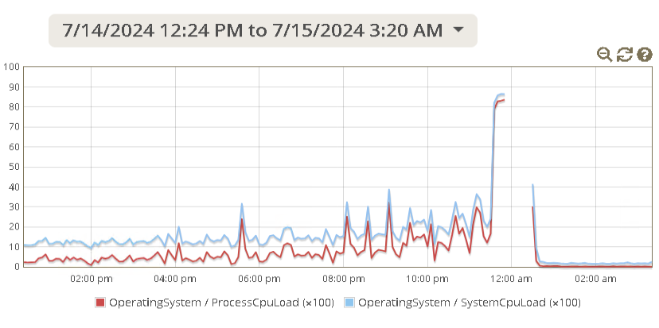

# cpuhogtd (CPU Hog Thread Dump)

Why we need such an agent?  
With JDK we can use `jstack` to dump the threads. With JRE, we can use some third-party library like [glowroot](https://github.com/glowroot/glowroot).  
However, the application may become totally unresponsive after CPU hog for a few minutes. In some situation,  glowroot web UI cannot be accessed either. It is also too late if you use other tools like `jstack`.

Also the CPU hog can happen at any time. It is very likely that it is too late when you realize it and try to intervene.

This agent tries to dump the threads before the application (process) becomes unresponsive. 

## config.json

```
{
  "LateStart": 300000,
  "IgnoreUnder": 5.0,
  "CPUThreshold": 60.0,
  "CheckInterval": 60000,
  "AggressiveInterval": 1000,
  "ConcernThreshold": 10,
  "OutputCPU": false,
}
```

`LateStart`, the default value is `5` minutes (= `300,000` milliseconds). The monitoring will begin `5` minutes after the targeted application starts up. Generally the start-up is also CPU intensive, but we are not interested in this part, so we should skip it.

`IgnoreUnder`, the default value is `5.0%`. Some threads may run at the same time but with tiny CPU. We can ignore them and focus on the main ones. The stack trace of these threads with CPU under this value will not be logged.

`CPUThreshold`, the default value is `60.0%`. The agent will activate the alarm when the CPU of the monitored process is over this amount. 

`CheckInterval`, the default value is `60,000` ms (=1 minute). This has to be carefully selected. It is recommended to be half of the peak range or smaller.

`AggressiveInterval`: the default value is `1,000` ms (=1 sec).  
Once the alarm is activated, the agent enters to the aggressive mode, check the CPU more frequently.As you can imagine, `AggressiveInterval` should be much less than `CheckInterval`.

`ConcernThreshold`: the default value is `10`.  
In the aggressive mode, the concern will be added 1 up if the CPU is over the `CPUThreshold`. Once the total of the concern is equal to `ConcernThreshold`, The agent will try to dump the thread. 

`OutputCPU`: the default value is `false`. If you want to output the process CPU at each check point spaced with `CheckInterval`, change it to `true`.


With the CPU  *Gauge* in glowroot, you can analyze the pattern, then decide the values inside the `config.json`.



For this example, normally the CPU usage was under `40%`. The peak (over 80%) lasted about 10-15 minutes.

In this case,  `CheckInterval` can be set as big as `5` minutes (half of `10`).

# How to test

In order to simulate a real case, CPU spike, we can use [FakeLoad](https://github.com/msigwart/fakeload) in your JAVA application.
I tried it in [DualShield](https://web.deepnetsecurity.com/products/dualshield/), a commercial MFA product which can call groovy script in its *Task*.

Download the `fakeload-0.7.0.jar` at https://repo1.maven.org/maven2/com/martensigwart/fakeload/0.7.0/fakeload-0.7.0.jar. Put it into this folder,
`C:\Program Files\Deepnet DualShield\tomcat\dualapp\das5\WEB-INF\lib`, then restart the service.

Create a task,

```
import com.martensigwart.fakeload.*;
import java.util.concurrent.TimeUnit;
FakeLoad fakeload = FakeLoads.create()
        .lasting(60, TimeUnit.SECONDS)
        .withCpu(70)
        .withMemory(30, MemoryUnit.MB);

// Execute FakeLoad synchronously
FakeLoadExecutor executor = FakeLoadExecutors.newDefaultExecutor();
executor.execute(fakeload);

```

Then run it, you should get the similar result. 

```
2024-08-10 22:43:49,311 INFO [Thread-0] c.o.a.CPUMonitor [CPUMonitor.java:227] [34.499%] "pool-13-thread-3" #206  cpu=3484ms elapsed=5050ms
2024-08-10 22:43:49,311 INFO [Thread-0] c.o.a.CPUMonitor [CPUMonitor.java:231]  at java.lang.Thread.sleep(Native Method)
2024-08-10 22:43:49,311 INFO [Thread-0] c.o.a.CPUMonitor [CPUMonitor.java:231]   at com.martensigwart.fakeload.CpuSimulator.simulateLoad(CpuSimulator.java:35)
2024-08-10 22:43:49,311 INFO [Thread-0] c.o.a.CPUMonitor [CPUMonitor.java:231]    at com.martensigwart.fakeload.AbstractLoadSimulator.run(AbstractLoadSimulator.java:102)
2024-08-10 22:43:49,311 INFO [Thread-0] c.o.a.CPUMonitor [CPUMonitor.java:231]     at java.util.concurrent.CompletableFuture$AsyncRun.run(CompletableFuture.java:1640)
2024-08-10 22:43:49,311 INFO [Thread-0] c.o.a.CPUMonitor [CPUMonitor.java:231]      at java.util.concurrent.ThreadPoolExecutor.runWorker(ThreadPoolExecutor.java:1149)
2024-08-10 22:43:49,311 INFO [Thread-0] c.o.a.CPUMonitor [CPUMonitor.java:231]       at java.util.concurrent.ThreadPoolExecutor$Worker.run(ThreadPoolExecutor.java:624)
2024-08-10 22:43:49,311 INFO [Thread-0] c.o.a.CPUMonitor [CPUMonitor.java:231]        at java.lang.Thread.run(Thread.java:750)
2024-08-10 22:43:49,311 INFO [Thread-0] c.o.a.CPUMonitor [CPUMonitor.java:227] [34.808%] "pool-13-thread-2" #205  cpu=3515ms elapsed=5050ms
2024-08-10 22:43:49,311 INFO [Thread-0] c.o.a.CPUMonitor [CPUMonitor.java:231]  at java.lang.Thread.sleep(Native Method)
2024-08-10 22:43:49,311 INFO [Thread-0] c.o.a.CPUMonitor [CPUMonitor.java:231]   at com.martensigwart.fakeload.CpuSimulator.simulateLoad(CpuSimulator.java:35)
2024-08-10 22:43:49,311 INFO [Thread-0] c.o.a.CPUMonitor [CPUMonitor.java:231]    at com.martensigwart.fakeload.AbstractLoadSimulator.run(AbstractLoadSimulator.java:102)
2024-08-10 22:43:49,311 INFO [Thread-0] c.o.a.CPUMonitor [CPUMonitor.java:231]     at java.util.concurrent.CompletableFuture$AsyncRun.run(CompletableFuture.java:1640)
2024-08-10 22:43:49,311 INFO [Thread-0] c.o.a.CPUMonitor [CPUMonitor.java:231]      at java.util.concurrent.ThreadPoolExecutor.runWorker(ThreadPoolExecutor.java:1149)
2024-08-10 22:43:49,311 INFO [Thread-0] c.o.a.CPUMonitor [CPUMonitor.java:231]       at java.util.concurrent.ThreadPoolExecutor$Worker.run(ThreadPoolExecutor.java:624)
2024-08-10 22:43:49,311 INFO [Thread-0] c.o.a.CPUMonitor [CPUMonitor.java:231]        at java.lang.Thread.run(Thread.java:750)

```
I had 2 CPU cores on the VM, that is why you see `34.499`, as `34.499*2 = 69`, it is close to `70` we set in the task.

The `config.json` used in this test is,

```
{
  "LateStart": 300000,
  "IgnoreUnder": 5.0,
  "CPUThreshold": 60.0,
  "CheckInterval": 30000,
  "AggressiveInterval": 500,
  "ConcernThreshold": 10
}
```

You can also test this agent with [system-load-generator](https://github.com/pradykaushik/system-load-generator). Actually I used it to develop this project. 

It can only be run on LINUX, as it used `lscpu`, so I forked it at https://github.com/omnine/system-load-generator/tree/develop.

I used its scenario, `cpuload`.

`system-load-generator.bat --load-type cpuload`

Obviously you need to adjust its configuration to match `config.json` used by this project.

## Usage

`-javaagent:path/to/cpuhogtd-1.0-SNAPSHOT.jar`

During the test, I simply put the jar in the folder `c:\temp\cpuhog`,

`-javaagent:c:/temp/cpuhog/cpuhogtd-1.0-SNAPSHOT.jar`

The `config.json` should be placed in the same folder.

The log file `threaddump.log` will be generated in the same folder.

## References

[CPU Load Generator in Java](https://blog.caffinc.com/2016/03/cpu-load-generator/)
[system-load-generator](https://github.com/pradykaushik/system-load-generator)

https://github.com/c2nes/jtopthreads

https://github.com/msigwart/fakeload